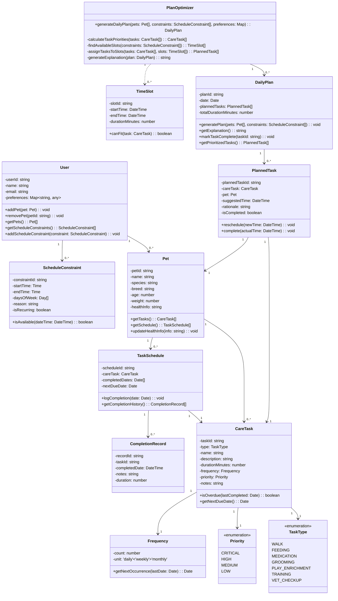

# PawPal Class Diagram

## Key Design Concepts

**User Management**
- Users can manage multiple pets and schedule constraints
- Preferences allow customization of plan generation

**Pet & Care Tasks**
- Each pet has multiple care tasks with different types, frequencies, and priorities
- Tasks track duration and dependencies

**Planning & Optimization**
- PlanOptimizer generates daily plans based on pets, constraints, and preferences
- PlannedTask includes rationale for why a task is scheduled at a specific time
- Daily plans explain their logic to the user

**Tracking & History**
- TaskSchedule maintains completion history
- CompletionRecord logs when tasks were actually completed

**Constraints**
- ScheduleConstraint models owner availability (blocked times)
- Supports recurring constraints
