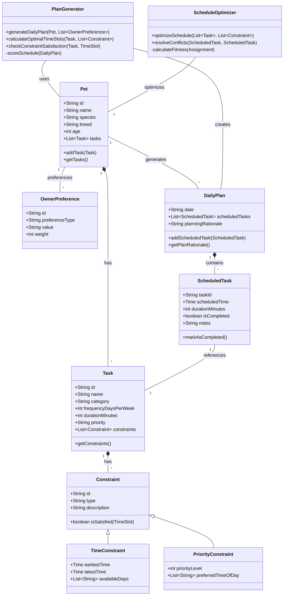

## Pet Care App - Class Diagram

### Core Classes:
- **Pet** — Represents a pet and its associated tasks
- **Task** — A care activity (walk, feed, meds, etc.) with frequency and duration
- **Constraint** — Abstract class for scheduling constraints (time-based, priority-based)
- **OwnerPreference** — Owner's scheduling preferences (time of day, priority weight)
- **DailyPlan** — Generated schedule with reasoning for the pet's daily activities
- **ScheduledTask** — A task assigned to a specific time slot
- **PlanGenerator** — Creates optimal daily plans considering all constraints
- **ScheduleOptimizer** — Resolves conflicts and optimizes task ordering

### Key Features:
- Tracks multiple task types (walks, feeding, meds, enrichment, grooming)
- Supports flexible constraints (time windows, availability, priorities)
- Generates daily plans with explanations of scheduling decisions
- Allows owner preferences to influence plan generation
